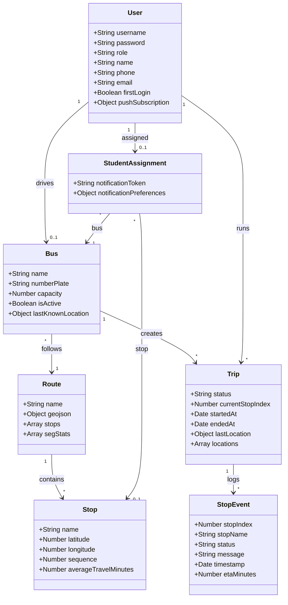
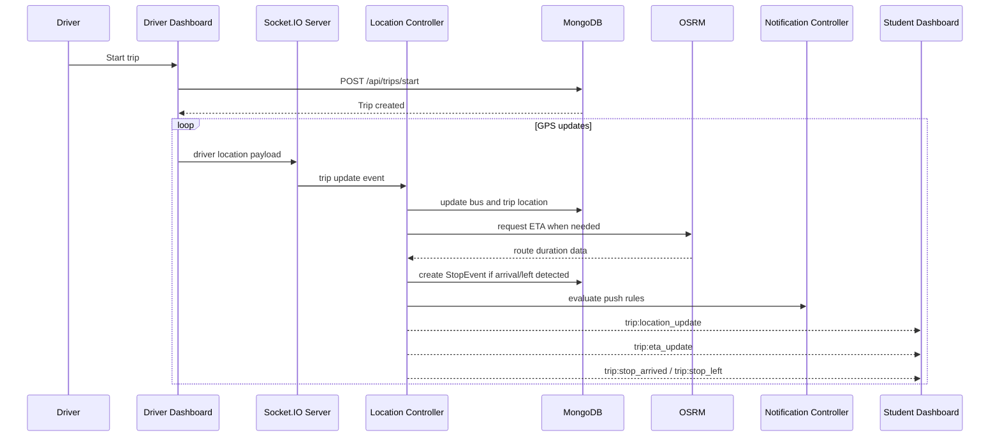
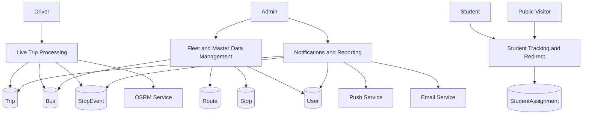

# TrackMate - Diagram Content

This file contains diagram-ready content for section 5.2 of the project documentation.

## 5.2.1 Use Case Diagram

### System Boundary

System name: `TrackMate School Bus Tracking System`

### Actors

- Admin
- Driver
- Student
- Public Visitor
- Notification Service
- Email Service
- OSRM Routing Service

### Admin Use Cases

- Login
- View dashboard
- Manage buses
- Manage drivers
- Manage routes
- Manage stops
- Manage students
- Assign students to buses and stops
- View active trips
- View live bus map
- View event history
- View analytics
- Export trip CSV

### Driver Use Cases

- Login
- View assigned bus
- Start trip
- Share GPS location
- View route progress
- Trigger SOS
- End trip
- Run simulator mode

### Student Use Cases

- Login
- View assigned bus
- View live location
- View ETA
- View recent stop events
- Manage notification preferences
- Enable push notifications
- Report missed bus
- View redirect status
- Cancel redirect
- Update personal assignment

### Public Visitor Use Cases

- View public bus list
- Open public tracking page
- Watch live public bus position

### External Service Use Cases

- Notification Service sends push notifications
- Email Service sends welcome and reset emails
- OSRM Routing Service returns route durations

### Use Case Relationships

- `View dashboard` includes `View active trips`
- `View dashboard` includes `View live bus map`
- `Manage students` extends `Bulk upload students`
- `Report missed bus` includes `Find alternative bus`
- `Find alternative bus` includes `Check ongoing trips`
- `Share GPS location` includes `Update trip state`
- `Share GPS location` includes `Compute ETA`
- `Share GPS location` includes `Detect stop arrival/departure`
- `Detect stop arrival/departure` includes `Create stop event`

### Diagram Notes

- Draw TrackMate as one system boundary.
- Place Admin, Driver, Student, and Public Visitor on the left and right sides.
- Place Notification Service, Email Service, and OSRM Routing Service outside the system boundary as external actors.

## 5.2.2 Class Diagram

### Core Classes

#### User

Attributes:

- _id
- username
- password
- role
- name
- phone
- email
- firstLogin
- driverMeta.bus
- pushSubscription
- assignedBusId
- assignedStopId

Relationships:

- One driver can be linked to one bus through `driverMeta.bus`
- One student can have one `StudentAssignment`

#### Bus

Attributes:

- _id
- name
- numberPlate
- capacity
- driver
- route
- isActive
- lastKnownLocation

Relationships:

- One bus belongs to one route
- One bus can have one active driver
- One bus can have many trips over time
- One bus can have many student assignments

#### Route

Attributes:

- _id
- name
- geojson
- stops[]
- segStats[]

Relationships:

- One route contains many embedded stops
- One route can have many buses
- One route can have many trips
- One route has many `Stop` documents

#### Stop

Attributes:

- _id
- name
- latitude
- longitude
- sequence
- route
- averageTravelMinutes

Relationships:

- Many stops belong to one route
- One stop can be referenced by many student assignments over time

#### Trip

Attributes:

- _id
- bus
- driver
- route
- status
- currentStopIndex
- startedAt
- endedAt
- lastLocation
- locations[]

Relationships:

- Many trips belong to one bus over time
- Many trips belong to one driver over time
- Many trips belong to one route over time
- One trip can create many stop events

#### StudentAssignment

Attributes:

- _id
- student
- bus
- stop
- notificationToken
- notificationPreferences

Relationships:

- One assignment belongs to one student
- One assignment points to one bus
- One assignment points to one stop

#### StopEvent

Attributes:

- _id
- trip
- stop
- stopIndex
- stopName
- status
- message
- timestamp
- location
- source
- etaMinutes

Relationships:

- Many stop events belong to one trip
- A stop event may reference one stop

### Supporting Service Classes

- AuthController
- AdminController
- DriverController
- StudentController
- LocationController
- MissedBusController
- NotificationController
- EtaCalculator
- SegmentStats
- ActiveTripsCache

### Suggested Mermaid Class Diagram

## 5.2.3 Sequence Diagram

### Scenario

Student views live bus tracking after a driver starts a trip and sends location updates.

### Participants

- Driver
- Driver Dashboard
- Socket.IO Server
- Location Controller
- MongoDB
- Student Dashboard
- Notification Controller
- OSRM Service

### Sequence Steps

1. Driver logs in.
2. Driver starts a trip.
3. Backend creates a Trip document with status `ONGOING`.
4. Driver dashboard begins sending GPS payloads.
5. Socket.IO server forwards payloads to `locationController`.
6. `locationController` validates and throttles the update.
7. Active trip state is loaded from memory or database.
8. Bus last-known location is updated.
9. Trip breadcrumb history is appended.
10. ETA is requested from OSRM or computed from fallback logic.
11. Stop detection checks current stop radius and dwell time.
12. If a stop state changes, a StopEvent is stored.
13. Live payloads are emitted to student and admin subscribers.
14. Notification logic checks proximity and arrival rules.
15. Student dashboard updates bus marker, ETA, and stop timeline.

### Suggested Mermaid Sequence Diagram

## 5.2.4 Collaboration Diagram

### Purpose

Show how runtime objects collaborate during one live location update.

### Objects

- `driverDashboard`
- `socketServer`
- `locationController`
- `activeTripState`
- `tripModel`
- `busModel`
- `etaCalculator`
- `segmentStats`
- `notificationController`
- `studentDashboard`
- `adminDashboard`

### Message Flow

1. `driverDashboard -> socketServer`: send location payload
2. `socketServer -> locationController`: dispatch update
3. `locationController -> activeTripState`: get current live state
4. `locationController -> busModel`: update lastKnownLocation
5. `locationController -> tripModel`: append breadcrumb and update lastLocation
6. `locationController -> etaCalculator`: compute raw ETA
7. `etaCalculator -> segmentStats`: use learned route segment data if needed
8. `locationController -> tripModel`: save stop event when arrival or departure occurs
9. `locationController -> notificationController`: evaluate proximity and arrival alerts
10. `locationController -> studentDashboard`: emit live trip updates
11. `locationController -> adminDashboard`: emit fleet-relevant updates

### Suggested Collaboration Layout

- Put `locationController` in the center.
- Place `driverDashboard` and `socketServer` on the left.
- Place `tripModel`, `busModel`, and `activeTripState` below.
- Place `etaCalculator`, `segmentStats`, and `notificationController` on the right.
- Place `studentDashboard` and `adminDashboard` at the top-right as observers.

## 5.2.5 Data Flow Diagram

### Context-Level DFD

External entities:

- Admin
- Driver
- Student
- Public Visitor
- OSRM Service
- Email Service
- Push Service

Central process:

- TrackMate Bus Tracking System

Major data flows:

- Driver sends credentials and live GPS updates
- Admin sends management requests and receives dashboards and reports
- Student requests ETA, trip state, and receives notifications and redirect info
- Public visitor requests bus list and public tracking details
- System exchanges route duration requests with OSRM
- System sends email payloads to email service
- System sends push payloads to push infrastructure

### Level-1 DFD Processes

#### Process 1: Authentication and Profile Management

Inputs:

- Login credentials
- Profile updates
- Forgot-password requests

Outputs:

- JWT token
- User profile
- Password reset email request

Data stores:

- User collection

#### Process 2: Fleet and Master Data Management

Inputs:

- Bus data
- Driver data
- Route data
- Stop data
- Student data
- Assignment data

Outputs:

- Updated master records
- Admin lists and forms data

Data stores:

- Bus collection
- Route collection
- Stop collection
- User collection
- StudentAssignment collection

#### Process 3: Live Trip Processing

Inputs:

- Driver GPS updates
- Driver trip actions

Outputs:

- Live bus position
- ETA updates
- Stop events
- Trip status updates

Data stores:

- Trip collection
- Bus collection
- StopEvent collection
- Active trip memory cache

#### Process 4: Student Tracking and Redirect

Inputs:

- Student trip/ETA requests
- Notification preference updates
- Missed-bus reports

Outputs:

- Student live dashboard data
- Redirect response
- Notification preference state

Data stores:

- StudentAssignment collection
- Trip collection
- User collection
- In-memory redirect map

#### Process 5: Notifications and Reporting

Inputs:

- Stop events
- Proximity checks
- Admin analytics/export requests

Outputs:

- Push notifications
- Emails
- Analytics response
- CSV export

Data stores:

- StopEvent collection
- Trip collection
- User collection

### Suggested Mermaid Flowchart for DFD Overview

