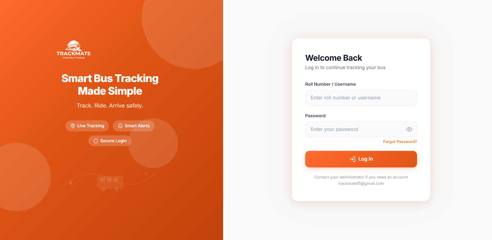
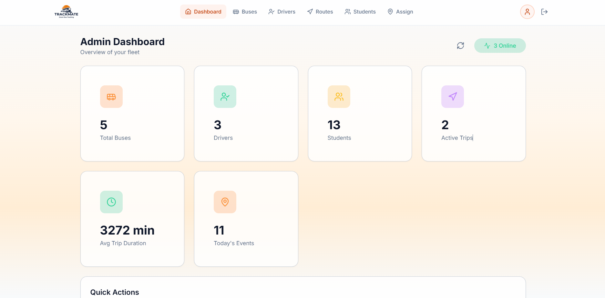
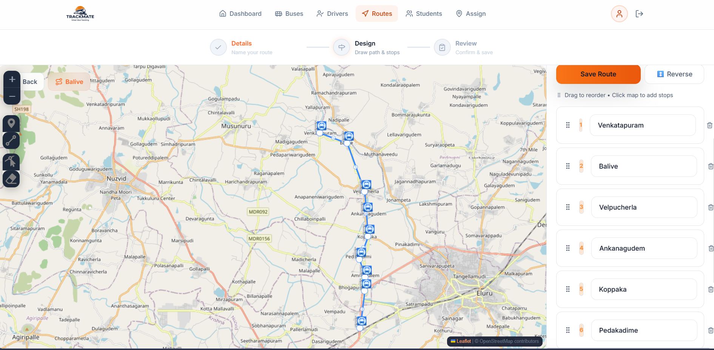
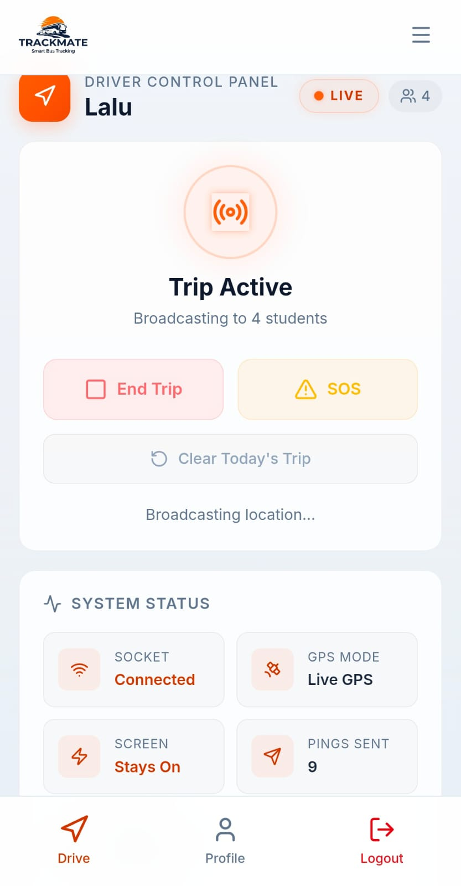
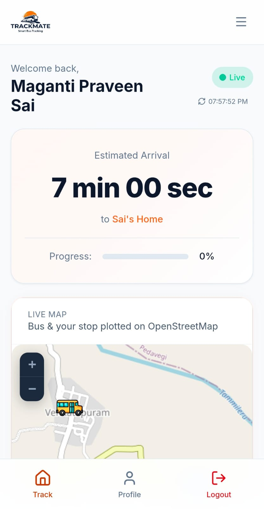
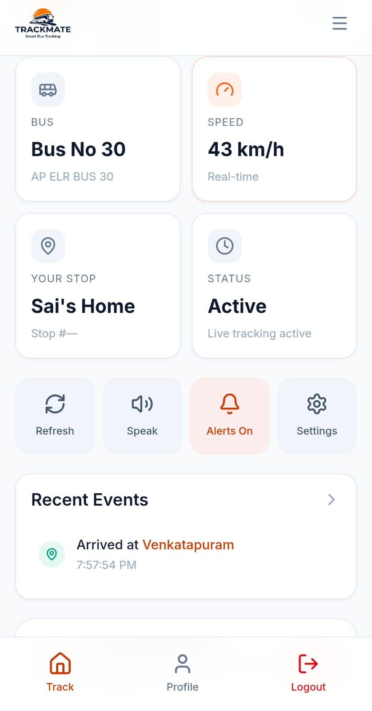
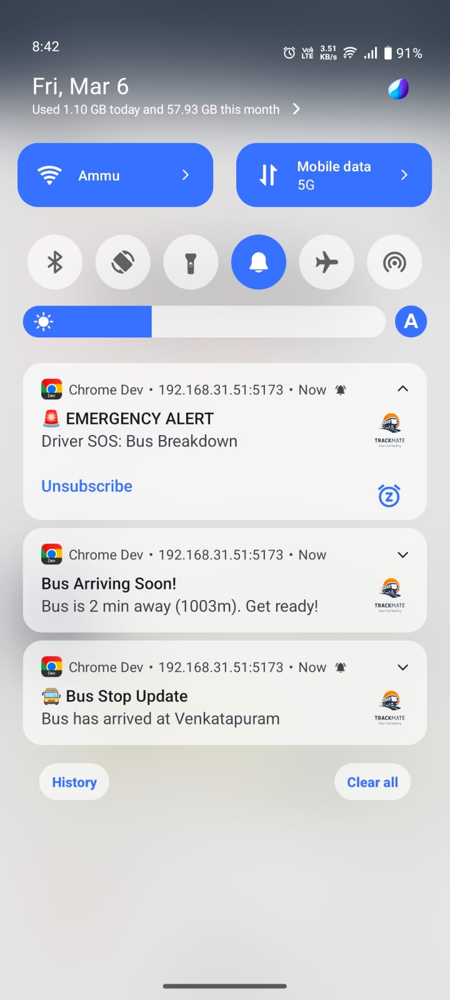
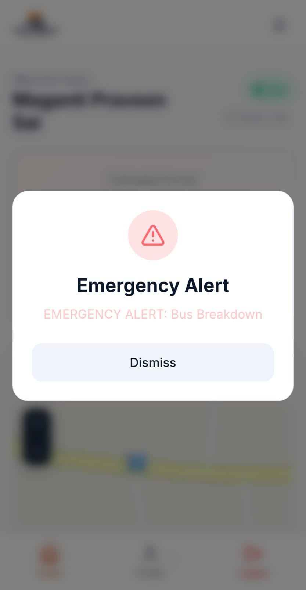

# TrackMate

TrackMate is a full-stack school bus tracking system built for Ramachandra College of Engineering, Eluru. It provides live bus tracking, ETA updates, stop-based notifications, route and fleet management, public tracking links, and driver-side trip control in a mobile-friendly web app.

## Project Modules

- Frontend: React + Vite single-page app in `frontend/`
- Backend: Express + Socket.IO + MongoDB API in `backend/`
- Public tracking: open `/track` and `/track/:busName`
- Admin tools: buses, drivers, routes, stops, students, assignments, analytics, CSV export
- Driver tools: trip start/end, live GPS sharing, simulator, SOS
- Student tools: live trip view, ETA, notification preferences, missed-bus redirect

## Tech Stack

- Frontend: React 18, Vite 7, React Router 6, Leaflet, Socket.IO client, Bootstrap, Framer Motion
- Backend: Node.js, Express 4, Socket.IO, MongoDB/Mongoose, JWT, bcryptjs, web-push
- Utilities: OSRM routing, CSV import/export, service worker, PWA support

## Run Locally

### Backend

```bash
cd backend
npm install
npm run dev
```

Required environment values include at least:

```env
MONGO_URI=your_mongodb_connection_string
DB_NAME=TrackMatev1
JWT_SECRET=your_jwt_secret
PORT=5000
```

Optional values:

```env
ALLOWED_ORIGINS=http://localhost:5173,http://localhost:3000
OSRM_BASE_URL=http://router.project-osrm.org
STALE_TRIP_HOURS=12
VAPID_PUBLIC_KEY=your_public_key
VAPID_PRIVATE_KEY=your_private_key
VAPID_EMAIL=mailto:admin@example.com
BREVO_API_KEY=your_brevo_key
EMAIL_USER=your_email
```

### Frontend

```bash
cd frontend
npm install
npm run dev
```

Optional frontend environment values:

```env
VITE_BACKEND_URL=http://localhost:5000
VITE_VAPID_PUBLIC_KEY=your_public_key
VITE_MIN_UPDATE_INTERVAL_MS=1000
```

## Default Admin

On startup, the backend seeds a default admin if one does not exist:

- Username: `ad1`
- Password: `ad1`

Change this immediately outside development.

## Screenshots

### Login



### Admin Dashboard



### Route Creation



### Driver Dashboard



### Student Dashboard





### Push Notifications



### SOS Emergency



## Documentation

- Detailed system documentation: `PROJECT_DOCUMENTATION.md`
- IEEE-style write-up: `IEEE.md`
- UI documentation: `ui.md`
- LLM/project knowledge base: `llm.md`
- Diagram source content: `DIAGRAM_CONTENT.md`