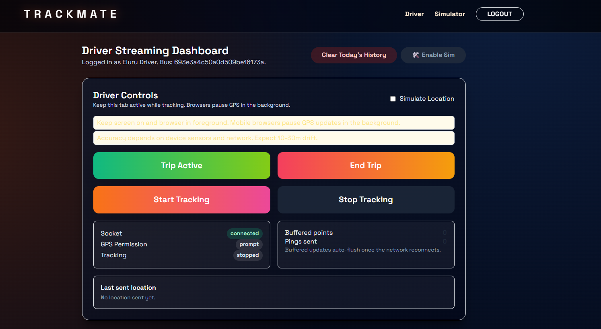
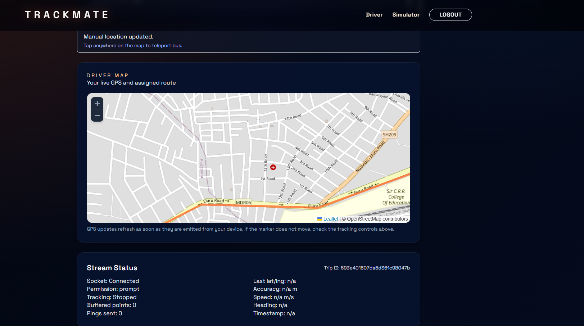
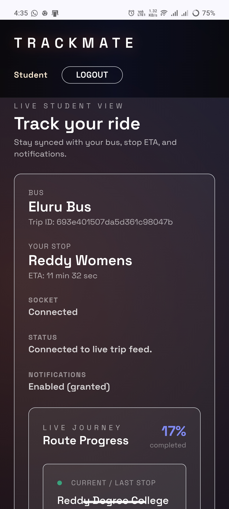

# TrackMate - Real-Time School Bus Tracking System

> **Next-Gen Campus Transit Logic: Real-Time, Predictive, and "God Mode" Enabled.**

TrackMate is a modern, full-stack progressive web application (PWA) designed to solve the chaos of school bus tracking. It avoids the pitfalls of laggy GPS by implementing intelligent smoothing, real-time socket simulation known as "God Mode," and a sophisticated admin "Route Lab" for managing transit networks.



## 🚀 Key Features

*   **⚡ "God Mode" Simulation**: Drivers can toggle a simulation loop that mimics real GPS movement or "teleport" instantly by clicking a map location. Critical for testing without driving a bus.
*   **🧠 Intelligent ETA Engine**: The backend (`locationController.js`) uses OSRM for precise routing but falls back to "crow-flies" logic if the routing server times out (>1.5s), ensuring zero lag for end-users.
*   **🧪 Route Lab**: A powerful Admin interface built with **React Portals** and **@dnd-kit**. Administrators can draw routes on the map and drag-and-drop stops in the sidebar to reorder them in real-time.
*   **📴 Offline-First PWA**: A custom Service Worker (`sw.js`) ensures students receive "Bus Arrived" push notifications even when the app is closed or the phone is locked. No more "silent failures."

## 🛠️ Technology Stack

*   **Frontend**: React (Vite), Leaflet (Maps), @dnd-kit (Drag & Drop), Socket.io-client.
*   **Backend**: Node.js, Express, MongoDB (Mongoose).
*   **Real-Time**: Socket.io (Bi-directional low-latency communication).
*   **Mobile**: PWA (Manifest + Service Worker) for installable app-like experience.

## 🏁 Quick Start

### Prerequisites
*   Node.js (v18+)
*   MongoDB (Local or Atlas URI)

### 1. Clone the Repository
```bash
git clone https://github.com/your-username/trackmate.git
cd trackmate
```

### 2. Backend Setup
```bash
cd backend
npm install
# Create .env according to the template below
npm run dev
```

### 3. Frontend Setup
```bash
cd ../frontend
npm install
npm run dev
```

The app should now be running at `http://localhost:5173` (Frontend) and `http://localhost:5000` (Backend).

## 🔑 Environment Variables (.env.example)

Create a `.env` file in the `backend/` directory:

```properties
PORT=5000
MONGO_URI=mongodb://localhost:27017/trackmate
JWT_SECRET=your_super_secret_jwt_key
CLIENT_URL=http://localhost:5173
VAPID_PUBLIC_KEY=your_web_push_public_key
VAPID_PRIVATE_KEY=your_web_push_private_key
```

## 📸 Screenshots

| Driver Simulation | Route Lab | Student View |
|:---:|:---:|:---:|
|  |  |  |
