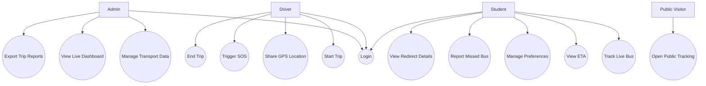
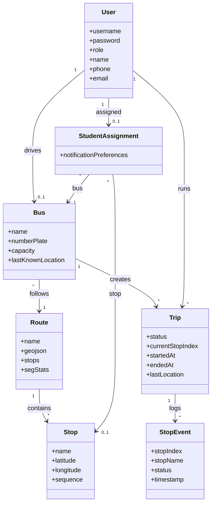
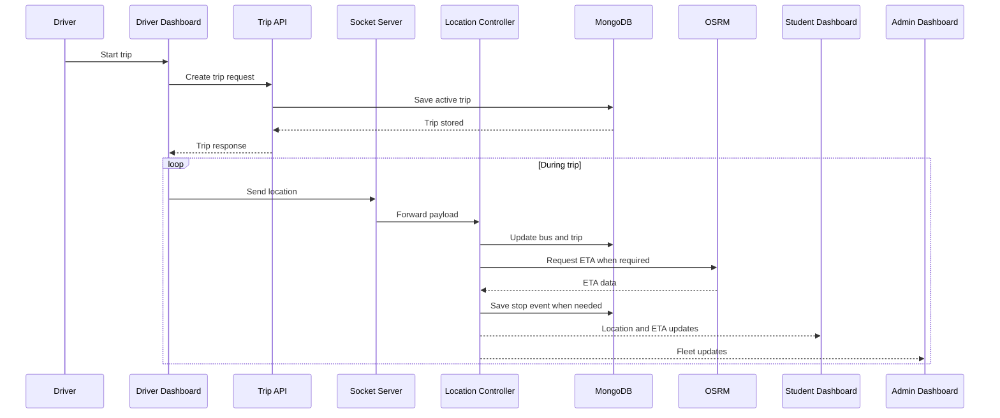
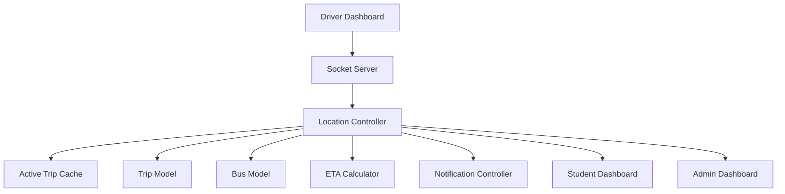
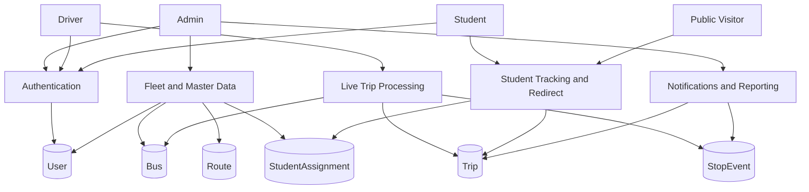

# TrackMate - Appendix

This appendix file contains only Mermaid diagrams and testing tables for easy copy-paste into the final project report.

---

## Appendix A - Mermaid Diagrams

### A.1 Use Case Diagram

### A.2 Class Diagram

### A.3 Sequence Diagram

### A.4 Collaboration Diagram

### A.5 Data Flow Diagram

---

## Appendix B - Testing Tables

### B.1 Testing Methodology Summary

| Testing Type | Purpose | Focus Area | Example Validation |
| --- | --- | --- | --- |
| Unit Testing | Validate small logic units independently | Utility functions, validation logic, normalization, ETA helpers | Verify stop normalization or password validation works correctly |
| Integration Testing | Validate connected modules working together | APIs plus database plus frontend flows | Verify trip start, live update, and student dashboard fetch work together |
| Acceptance Testing | Validate user-facing behavior against requirements | Admin, driver, student, and public workflows | Verify student can track an assigned bus successfully |

### B.2 Detailed Test Cases

| Test Case ID | Module | Precondition | Test Description | Expected Result | Actual Result | Tested By | Test Date | Status | Remarks |
| --- | --- | --- | --- | --- | --- | --- | --- | --- | --- |
| TC-01 | Login | Admin account exists | Login with valid admin credentials | Admin dashboard opens successfully | __________ | __________ | __________ | Pass / Fail | __________ |
| TC-02 | Login | Admin account exists | Login with invalid password | Error message is displayed and access is denied | __________ | __________ | __________ | Pass / Fail | __________ |
| TC-03 | Login | Unknown username used | Login with non-existent account | Authentication fails | __________ | __________ | __________ | Pass / Fail | __________ |
| TC-04 | Profile | User is logged in | Update name, phone, and email | Profile changes are saved successfully | __________ | __________ | __________ | Pass / Fail | __________ |
| TC-05 | Profile | User is logged in | Change password with valid current password | New password is accepted and stored | __________ | __________ | __________ | Pass / Fail | __________ |
| TC-06 | Profile | User is logged in | Change password with wrong current password | Password update is rejected | __________ | __________ | __________ | Pass / Fail | __________ |
| TC-07 | Forgot Password | User email exists | Submit forgot-password request | Temporary password workflow is triggered | __________ | __________ | __________ | Pass / Fail | __________ |
| TC-08 | Route Management | Admin is logged in | Create route with valid stop list | Route is stored successfully | __________ | __________ | __________ | Pass / Fail | __________ |
| TC-09 | Route Management | Admin is logged in | Create route without stops | Validation error is shown | __________ | __________ | __________ | Pass / Fail | __________ |
| TC-10 | Route Management | Existing route exists | Update route stop order | Route and stop sequence are updated | __________ | __________ | __________ | Pass / Fail | __________ |
| TC-11 | Stop Management | Route exists | Create stop for a route | Stop is created and linked correctly | __________ | __________ | __________ | Pass / Fail | __________ |
| TC-12 | Stop Management | Stop exists | Delete stop assigned to students | Stop is removed and related assignments are cleaned up | __________ | __________ | __________ | Pass / Fail | __________ |
| TC-13 | Bus Management | Admin is logged in | Create bus with valid details | Bus is stored successfully | __________ | __________ | __________ | Pass / Fail | __________ |
| TC-14 | Bus Management | Bus and driver exist | Assign driver and route to a bus | Driver meta and bus mapping update correctly | __________ | __________ | __________ | Pass / Fail | __________ |
| TC-15 | Bus Management | Bus has active trip | Attempt to delete bus | Deletion is blocked until trip ends | __________ | __________ | __________ | Pass / Fail | __________ |
| TC-16 | Driver Management | Admin is logged in | Create driver account | Driver account is created | __________ | __________ | __________ | Pass / Fail | __________ |
| TC-17 | Student Management | Admin is logged in | Create student account manually | Student account is created with first-login flag | __________ | __________ | __________ | Pass / Fail | __________ |
| TC-18 | Student Management | CSV file prepared | Bulk upload students through CSV | Valid rows are imported and invalid rows are reported | __________ | __________ | __________ | Pass / Fail | __________ |
| TC-19 | Assignment | Student, bus, and stop exist | Assign student to bus and stop | StudentAssignment is created or updated | __________ | __________ | __________ | Pass / Fail | __________ |
| TC-20 | Assignment | Assignment exists | Update existing assignment | Assignment changes are persisted | __________ | __________ | __________ | Pass / Fail | __________ |
| TC-21 | Trip Lifecycle | Driver has assigned bus | Start trip from driver dashboard | Trip is created with `ONGOING` status | __________ | __________ | __________ | Pass / Fail | __________ |
| TC-22 | Trip Lifecycle | Active trip exists | End trip from driver dashboard | Trip status changes to `COMPLETED` | __________ | __________ | __________ | Pass / Fail | __________ |
| TC-23 | Trip Lifecycle | No assigned bus | Driver attempts to start trip | Trip start is rejected with message | __________ | __________ | __________ | Pass / Fail | __________ |
| TC-24 | Live Tracking | Active trip exists | Send one valid location update | Bus and trip last location are updated | __________ | __________ | __________ | Pass / Fail | __________ |
| TC-25 | Live Tracking | Active trip exists | Send rapid repeated updates | Throttling prevents excessive processing | __________ | __________ | __________ | Pass / Fail | __________ |
| TC-26 | Live Tracking | Active trip exists | Join student dashboard during active trip | Student receives live location events | __________ | __________ | __________ | Pass / Fail | __________ |
| TC-27 | Stop Event | Active trip near next stop | Keep bus inside stop radius for dwell time | ARRIVED event is created | __________ | __________ | __________ | Pass / Fail | __________ |
| TC-28 | Stop Event | Bus has arrived at stop | Move bus beyond leave radius | LEFT event is created and progress advances | __________ | __________ | __________ | Pass / Fail | __________ |
| TC-29 | ETA | Student has active assigned trip | Request ETA from student dashboard | ETA is returned from live cache or fallback | __________ | __________ | __________ | Pass / Fail | __________ |
| TC-30 | ETA | OSRM unavailable or skipped | Request ETA during active trip | Fallback ETA is still returned when possible | __________ | __________ | __________ | Pass / Fail | __________ |
| TC-31 | Notifications | User logged in and VAPID configured | Save push subscription | Subscription is stored in user record | __________ | __________ | __________ | Pass / Fail | __________ |
| TC-32 | Notifications | Push subscription exists | Trigger test push | Test notification is sent successfully | __________ | __________ | __________ | Pass / Fail | __________ |
| TC-33 | Notifications | Arrival alert enabled | Bus arrives at assigned stop | Student receives arrival-related alert flow | __________ | __________ | __________ | Pass / Fail | __________ |
| TC-34 | SOS | Driver has active trip | Trigger SOS from driver dashboard | Admin receives SOS-related live alert | __________ | __________ | __________ | Pass / Fail | __________ |
| TC-35 | Public Tracking | Active bus exists | Open `/track` and select a bus | Public tracking page opens for selected bus | __________ | __________ | __________ | Pass / Fail | __________ |
| TC-36 | Public Tracking | Active bus exists | Open `/track/:busName` directly | Public live tracking page loads with current state | __________ | __________ | __________ | Pass / Fail | __________ |
| TC-37 | Public Tracking | No active trip for selected bus | Open public tracking page | Inactive message is shown instead of live map state | __________ | __________ | __________ | Pass / Fail | __________ |
| TC-38 | Redirect | Student has assignment and misses bus | Submit missed-bus request | Alternative ongoing bus is suggested if available | __________ | __________ | __________ | Pass / Fail | __________ |
| TC-39 | Redirect | Redirect exists | Check redirect status after refresh | Redirect state is restored correctly | __________ | __________ | __________ | Pass / Fail | __________ |
| TC-40 | Redirect | Redirect exists | Cancel redirect | Redirect state is cleared | __________ | __________ | __________ | Pass / Fail | __________ |
| TC-41 | Analytics | Completed trips exist | Open admin analytics | Analytics summary is displayed correctly | __________ | __________ | __________ | Pass / Fail | __________ |
| TC-42 | Export | Admin authenticated | Export trips as CSV | CSV file is generated and downloaded | __________ | __________ | __________ | Pass / Fail | __________ |
| TC-43 | Security | Student token used on admin route | Access admin endpoint with student role | Access is denied | __________ | __________ | __________ | Pass / Fail | __________ |
| TC-44 | Security | Missing token | Access protected route without auth | Request is rejected | __________ | __________ | __________ | Pass / Fail | __________ |
| TC-45 | Resilience | Trip older than stale threshold | Request active trip | Stale trip is auto-closed or excluded | __________ | __________ | __________ | Pass / Fail | __________ |