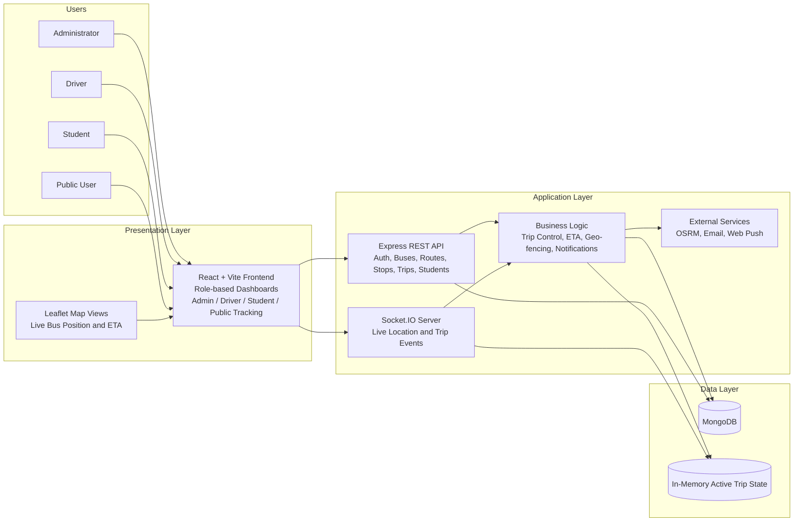
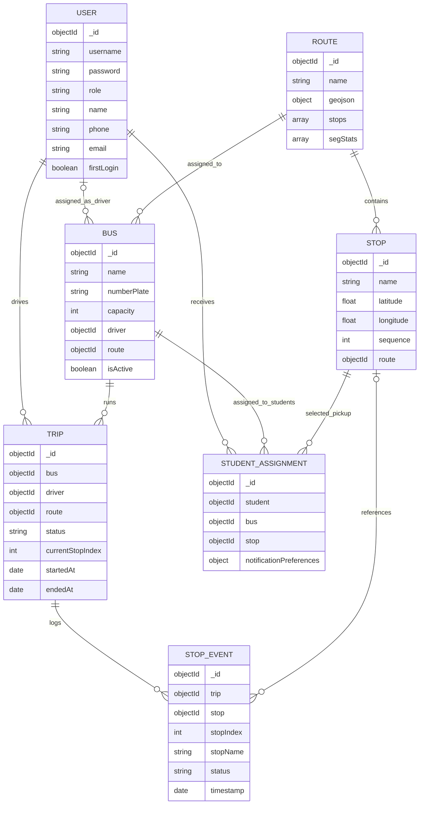
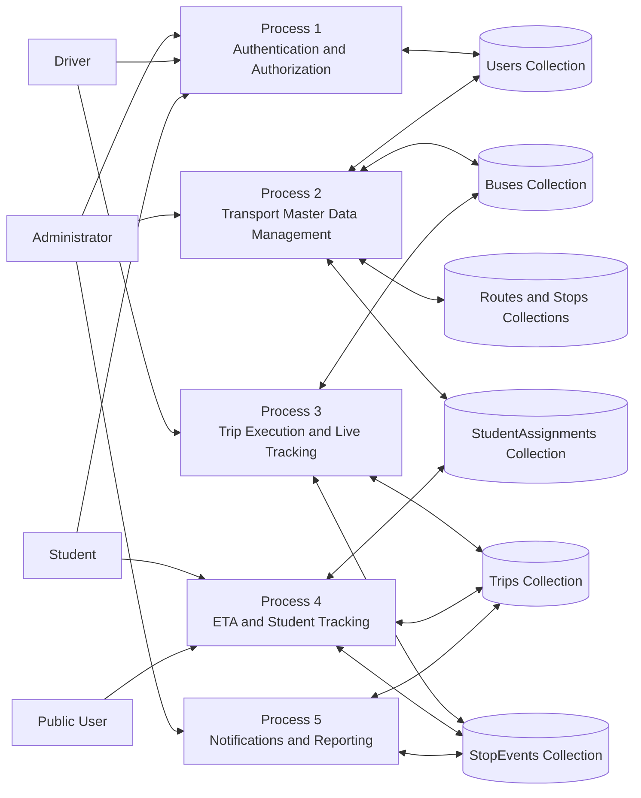
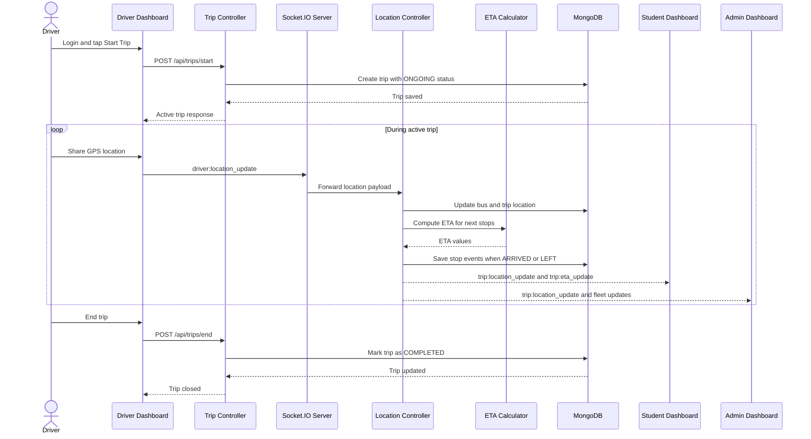
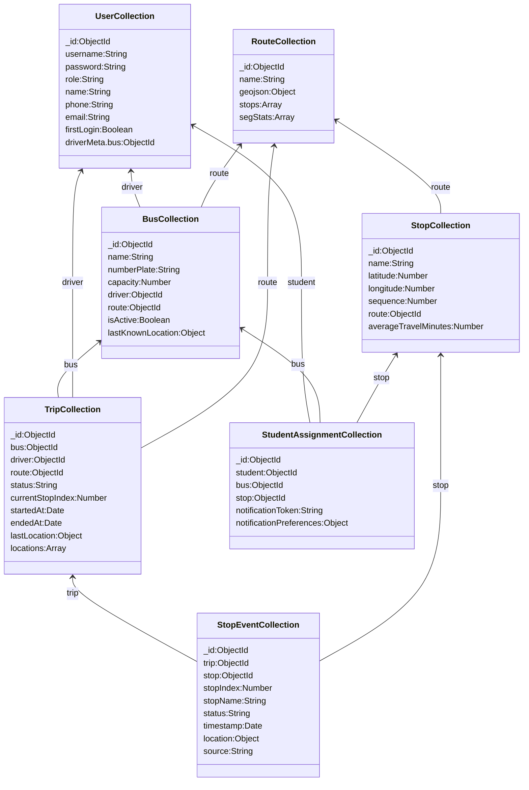

# CHAPTER 4 - SYSTEM DESIGN DIAGRAMS

This file contains Mermaid code for the Chapter 4 diagrams of TrackMate. The diagrams are based on the current implementation in the React frontend, Express and Socket.IO backend, and MongoDB data layer.

---

## 4.2 System Architecture

Figure 4.1: System Architecture of TrackMate

---

## 4.3 Use Case Diagram

Figure 4.2: Use Case Diagram for TrackMate System

```mermaid
flowchart TB
    Admin[Administrator]
    Driver[Driver]
    Student[Student]
    Public[Public User]

    Login((Login))
    ManageBuses((Manage Buses))
    ManageRoutes((Manage Routes))
    ManageStops((Manage Stops))
    ManageAssignments((Manage Student Assignments))
    MonitorTrips((Monitor Active Trips))
    ViewAnalytics((View Reports and Analytics))

    StartTrip((Start Trip))
    ShareLocation((Send Live GPS Updates))
    TriggerEmergency((Trigger SOS Alert))
    EndTrip((End Trip))

    TrackAssignedBus((Track Assigned Bus))
    ViewETA((View ETA))
    ManageAlerts((Manage Notification Preferences))
    ReportMissedBus((Report Missed Bus))
    ViewRedirect((View Alternative Bus Redirect))

    PublicTrack((View Public Tracking Page))

    Admin --> Login
    Admin --> ManageBuses
    Admin --> ManageRoutes
    Admin --> ManageStops
    Admin --> ManageAssignments
    Admin --> MonitorTrips
    Admin --> ViewAnalytics

    Driver --> Login
    Driver --> StartTrip
    Driver --> ShareLocation
    Driver --> TriggerEmergency
    Driver --> EndTrip

    Student --> Login
    Student --> TrackAssignedBus
    Student --> ViewETA
    Student --> ManageAlerts
    Student --> ReportMissedBus
    Student --> ViewRedirect

    Public --> PublicTrack
```

---

## 4.4 Entity Relationship Diagram (ER Diagram)

Figure 4.3: Entity Relationship Diagram for TrackMate

---

## 4.5 Data Flow Diagram (DFD)

Figure 4.4: Data Flow Diagram for TrackMate System

---

## 4.6 Sequence Diagram

Figure 4.5: Sequence Diagram for Real-Time Bus Tracking

---

## 4.7 Database Schema Design

Figure 4.6: Database Schema for TrackMate

