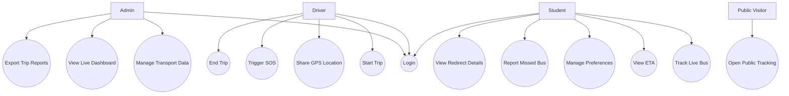
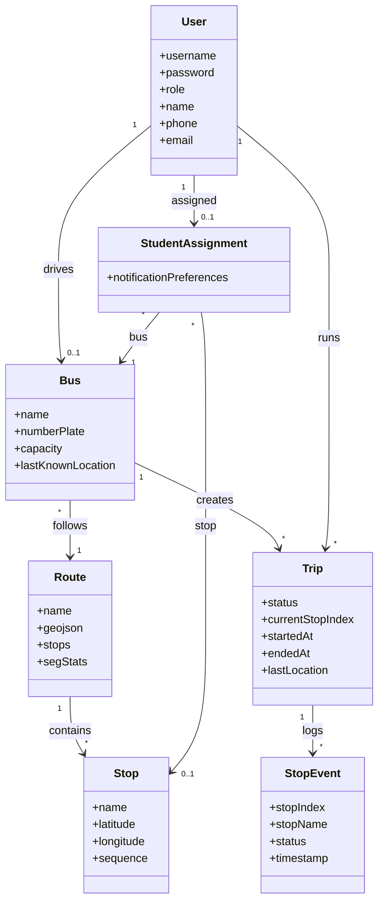
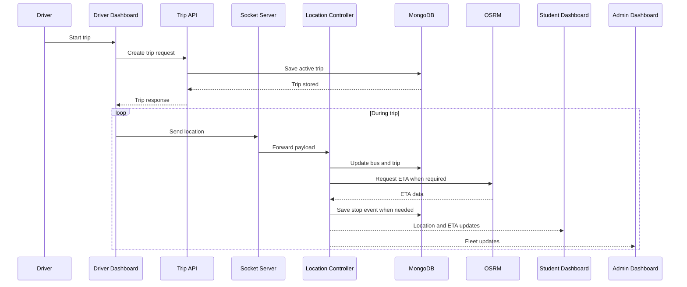
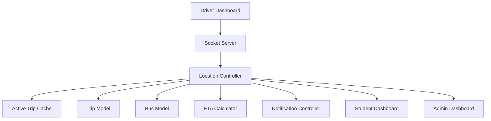
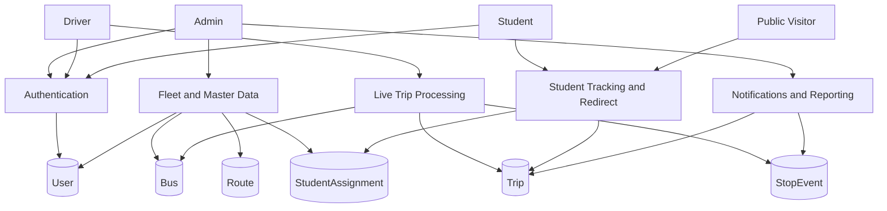

# TrackMate - Full Project Report Content

## Table of Contents

| Chapter / Section | Title | Page No. |
| --- | --- | --- |
| Abstract | Abstract | To be assigned |
| 1 | Introduction | To be assigned |
| 1.1 | Introduction | To be assigned |
| 1.2 | Overview of the Project | To be assigned |
| 1.3 | Objectives | To be assigned |
| 1.4 | Scope of the Project | To be assigned |
| 1.5 | Expected Outcome | To be assigned |
| 2 | Literature Survey | To be assigned |
| 3 | System Analysis | To be assigned |
| 3.1 | Existing System | To be assigned |
| 3.2 | Proposed System | To be assigned |
| 4 | System Study | To be assigned |
| 4.1 | Feasibility Study | To be assigned |
| 4.1.1 | Operational Feasibility | To be assigned |
| 4.1.2 | Economic Feasibility | To be assigned |
| 4.1.3 | Technical Feasibility | To be assigned |
| 4.2 | System Requirements | To be assigned |
| 4.2.1 | Hardware Requirements | To be assigned |
| 4.2.2 | Software Requirements | To be assigned |
| 5 | Project Architecture | To be assigned |
| 5.1 | System Architecture | To be assigned |
| 5.2 | Design and Diagrams | To be assigned |
| 5.2.1 | Use case Diagram | To be assigned |
| 5.2.2 | Class Diagram | To be assigned |
| 5.2.3 | Sequence Diagram | To be assigned |
| 5.2.4 | Collaboration Diagram | To be assigned |
| 5.2.5 | Data Flow Diagram | To be assigned |
| 6 | Methodology | To be assigned |
| 6.1 | Data Dictionary | To be assigned |
| 6.2 | Data Collection | To be assigned |
| 6.3 | Processing Techniques | To be assigned |
| 6.4 | Prepared Data | To be assigned |
| 7 | System Implementation | To be assigned |
| 7.1 | Real-Time Tracking & Processing | To be assigned |
| 7.2 | ETA Prediction & Notification Handling | To be assigned |
| 8 | Software Description | To be assigned |
| 9 | System Testing | To be assigned |
| 9.1 | Testing Methodology | To be assigned |
| 9.1.1 | Unit Testing | To be assigned |
| 9.1.2 | Integration Testing | To be assigned |
| 9.1.3 | Acceptance Testing | To be assigned |
| 9.2 | Test Cases | To be assigned |
| 10 | Coding | To be assigned |
| 11 | Results | To be assigned |
| 11.1 | Screenshots | To be assigned |
| 11.2 | Conclusion & Limitations | To be assigned |
| 11.3 | Future Scope | To be assigned |
| 12 | References & Bibliography | To be assigned |

## Abstract

TrackMate is a real-time school bus tracking and transport management platform developed for Ramachandra College of Engineering, Eluru. The project addresses the practical problem of transport uncertainty faced by students, administrators, and drivers in campus bus operations. Traditional transport systems usually depend on fixed timetables, manual coordination, phone calls, and informal communication, which often fail when buses are delayed, routes change, or students miss their assigned bus. TrackMate solves this problem through a browser-based system that combines live location updates, route-aware ETA estimation, event-based notifications, role-based dashboards, and public tracking access.

The system is implemented as a full-stack web application. The frontend is built using React and Vite, while the backend uses Node.js, Express, Socket.IO, and MongoDB. The application supports three main roles: admin, driver, and student. Administrators can manage buses, drivers, routes, stops, and student assignments while observing live fleet status and analytics. Drivers can start and end trips, share location updates, and trigger emergency alerts. Students can track their assigned bus, view estimated arrival times, manage alert preferences, and access an alternative-bus redirect workflow if they miss their original bus.

TrackMate also includes public tracking pages for active buses, push notification support through VAPID-based web push, email workflows for onboarding and password recovery, and a Progressive Web App style frontend. The project demonstrates how a relatively lightweight web architecture can deliver practical transport visibility and coordination for a campus environment. It also serves as a strong base for future work in transport analytics, operational reporting, and predictive planning.

---

## Introduction

This document presents the complete report content for the TrackMate project. It is structured in a chapter-oriented academic format so that it can be adapted for submission, print formatting, or conversion into a final institutional report.

---

## 1. Introduction

### 1.1 Introduction

Transportation plays a critical role in the functioning of an educational institution. Students depend on buses to reach campus on time, while administrators depend on reliable transport operations to maintain discipline, punctuality, and safety. In many colleges, bus transportation is still managed using static route schedules, manual attendance assumptions, paper-based coordination, or ad hoc communication methods. These methods are often insufficient when there are delays, traffic issues, route changes, or missed boarding situations.

The growth of mobile internet, web mapping, real-time communication systems, and cloud databases makes it possible to modernize this process without requiring expensive specialized hardware platforms. A browser-based transport solution can provide a live operational view of the bus system for all stakeholders. Such a system can reduce uncertainty, improve communication, and increase trust in the transport process.

TrackMate was created to address these needs. It is a real-time school bus tracking platform tailored to the requirements of Ramachandra College of Engineering, Eluru. The project combines location tracking, route management, ETA estimation, event logging, notifications, and role-specific dashboards into one integrated application.

### 1.2 Overview of the Project

TrackMate is a full-stack web application for real-time school or college bus tracking. It consists of two main parts:

- A React-based frontend for administrators, drivers, students, and public viewers.
- A Node.js and Express backend with MongoDB and Socket.IO support for data storage and live event broadcasting.

The system is designed around real operational needs rather than only demonstration features. The project supports:

- live bus location tracking,
- route and stop management,
- student-to-bus assignment,
- ETA calculation,
- stop arrival and departure detection,
- live dashboards,
- CSV import and export,
- push notifications,
- password recovery through email,
- missed-bus redirect support,
- public tracking links.

The backend processes driver location updates, persists trip history, computes ETA information, and emits live updates to subscribed clients. The frontend renders the current state of the transport system through role-based pages such as the admin dashboard, driver dashboard, student dashboard, and public tracking screens.

### 1.3 Objectives

The major objectives of TrackMate are:

1. To provide real-time tracking of buses for administrators and students.
2. To reduce the uncertainty caused by fixed and outdated bus schedules.
3. To allow drivers to operate trips using a dedicated live dashboard.
4. To provide administrators with a centralized transport management interface.
5. To compute ETA values using route-aware live processing instead of only static averages.
6. To generate stop arrival and departure events automatically during live trips.
7. To support notification workflows for student awareness.
8. To provide a missed-bus redirect workflow when an alternative active bus is available.
9. To maintain historical trip and event data for reporting and analytics.
10. To offer public bus tracking for selected buses without requiring login.

### 1.4 Scope of the Project

The scope of TrackMate includes transport operations inside an institutional bus environment, especially for fixed-route campus transport. The project focuses on the following scope boundaries:

- transport administration for buses, drivers, routes, and stops,
- live bus trip tracking,
- student assignment to buses and stops,
- real-time event and ETA visibility,
- notification support,
- public visibility of active bus trips.

The current implementation does not aim to cover all smart transport possibilities. It does not include advanced machine-learning forecasting, hardware telematics integration beyond driver-device location sharing, automatic payroll or finance systems, or offline-first full live synchronization. Its scope is intentionally centered on practical real-time visibility and route operations.

### 1.5 Expected Outcome

The expected outcome of the project is a deployable and usable transport tracking platform that improves the transport experience for all user groups.

Expected benefits include:

- better punctuality awareness for students,
- improved operational monitoring for administrators,
- more structured live trip handling for drivers,
- fewer missed communication incidents,
- easier transport planning through route and assignment management,
- an extensible digital foundation for further transport improvements.

---

## 2. Literature Survey

Existing transportation visibility systems generally fall into four categories: navigation platforms, public transport aggregators, fleet management platforms, and school- or institution-specific trackers.

General navigation platforms such as Google Maps and Waze provide route awareness and traffic information, but they are not designed to manage a fixed institutional fleet with role-based dashboards. Public transit apps such as Chalo or Moovit focus on broader transport discovery and passenger navigation, but they are not tailored to the assignment and administrative control needs of a college transport system. Commercial fleet platforms provide route and asset visibility, but they are often expensive, overgeneralized, or not designed for the day-to-day student transport problem. Some school tracking solutions rely on hardware GPS devices and SMS alerts, but those systems may not provide modern browser-based dashboards, public pages, or missed-bus logic.

From a technical perspective, modern web technologies enable a more direct solution. WebSocket communication allows low-latency live tracking updates. Web mapping libraries allow interactive route display. Document databases such as MongoDB support flexible trip and route structures. A React frontend can deliver a role-based interface without requiring separate native mobile applications.

The key research and implementation gap lies in combining the following into one academic-scale but operationally meaningful system:

- live bus location sharing,
- route-aware ETA updates,
- stop event tracking,
- student assignment workflows,
- missed-bus redirection,
- public bus tracking,
- notification integration.

TrackMate contributes by integrating these concerns into a practical campus transport platform. It emphasizes system integration, usability, and real operational value rather than focusing on only one isolated feature such as GPS display or route management.

---

## 3. System Analysis

System analysis is the process of examining the current transport problem, identifying existing limitations, and defining the structure of a more effective solution. In this project, system analysis was performed by observing the communication gaps and operational inefficiencies common in fixed-route institutional transportation.

### 3.1 Existing System

In a typical manual or semi-manual bus management setup, bus schedules are predetermined and circulated among students and administrators. Students are expected to wait based on approximate arrival times rather than actual live bus positions. If a bus is delayed because of traffic, weather, or operational changes, there is usually no centralized system to update students in real time.

The weaknesses of the existing system include:

1. No live visibility of the bus location.
2. Dependence on fixed timing assumptions.
3. No centralized transport dashboard for admins.
4. Weak driver-to-student communication during live trips.
5. No structured logging of stop events and route progress.
6. No formal support for redirecting a student to another bus after a missed stop.
7. Limited ability to export transport data for review.

As a result, students may miss buses, wait unnecessarily, or rely on informal communication. Administrators cannot easily verify fleet state at a glance, and drivers have no integrated system for reporting live operational conditions.

### 3.2 Proposed System

The proposed system is TrackMate, a live web-based bus tracking and transport management solution. The system replaces static uncertainty with live state visibility. It introduces four major operational layers:

1. Master data management for routes, stops, buses, drivers, students, and assignments.
2. Real-time trip control and GPS tracking.
3. ETA estimation and event-driven live updates.
4. Communication support through notifications, public tracking, and redirect workflows.

The proposed system improves the existing model in several ways:

- Students can see the current location of their assigned bus.
- Admins can monitor all active buses on a central dashboard.
- Drivers can start and end trips and run live tracking from a dedicated dashboard.
- ETA is computed dynamically rather than assumed from a fixed timetable.
- Stop arrival and departure states are processed as transport events.
- Missed-bus reporting can redirect a student to another suitable bus.
- Historical trip data can be analyzed and exported.

The proposed system is technically practical because it uses commonly available web technologies, cloud storage, browser notifications, and map interfaces instead of depending entirely on expensive specialized transport infrastructure.

---

## 4. System Study

System study evaluates whether the proposed solution is realistic and useful within the actual academic and technical environment.

### 4.1 Feasibility Study

The feasibility study of TrackMate considers operational, economic, and technical aspects.

#### 4.1.1 Operational Feasibility

Operational feasibility measures whether the system can be used effectively by the intended users.

TrackMate is operationally feasible because:

- the system provides separate role-based dashboards for admin, driver, and student users,
- the user workflows are aligned with everyday transport operations,
- students can use the system from a browser without learning complex software,
- drivers can operate trip controls through a phone-friendly dashboard,
- administrators gain visibility and management features without changing the transport structure itself.

The project fits into the daily operational routine of an educational institution. It reduces dependency on repeated manual updates and supports better coordination. Since users already rely on smartphones and the web, the transition from static schedules to a live dashboard model is practical.

Operational feasibility is further strengthened by the inclusion of:

- public tracking links,
- notification support,
- route-based assignment visibility,
- emergency status handling,
- data export for review.

#### 4.1.2 Economic Feasibility

Economic feasibility evaluates whether the benefits of the system justify the cost of development and operation.

TrackMate is economically feasible because it is built primarily on open-source technologies such as React, Node.js, Express, MongoDB, Socket.IO, and Leaflet. These tools reduce licensing costs significantly. The system can be hosted on affordable cloud services, and the frontend can be deployed on low-cost or free static platforms.

The key economic advantages include:

- no need for expensive enterprise software licensing,
- reuse of common student and administrator devices,
- elimination of many manual coordination costs,
- lower effort in responding to student uncertainty and route confusion,
- simple scaling through standard web infrastructure.

Although there are some operational costs associated with hosting, email delivery, and maintenance, these are relatively small compared to the value of improved transport coordination and reduced manual overhead. Therefore, the project is economically viable for an academic institution.

#### 4.1.3 Technical Feasibility

Technical feasibility evaluates whether the required solution can be built and maintained using the available technologies, skills, and infrastructure.

TrackMate is technically feasible because the chosen technology stack directly supports the project requirements:

- React enables modular, role-based frontend interfaces.
- Express and Node.js allow fast development of REST APIs.
- Socket.IO enables real-time communication for live bus tracking.
- MongoDB supports flexible storage for routes, trips, events, and assignments.
- Leaflet provides interactive map rendering.
- Web Push and email APIs support communication features.

The system also uses a practical architecture: live trip state is supported by in-memory processing while persistent records are stored in MongoDB. This hybrid design keeps the implementation manageable while still supporting real-time performance.

Technical feasibility is also strong because the project does not depend on highly specialized infrastructure. It can run with common development tools, standard web browsers, and normal internet connectivity.

### 4.2 System Requirements

The TrackMate platform requires both hardware and software support for development, testing, and deployment.

#### 4.2.1 Hardware Requirements

Minimum hardware requirements:

- Processor: dual-core processor or higher
- RAM: 4 GB minimum, 8 GB recommended for development
- Storage: 10 GB free storage or more
- Driver device: smartphone with GPS and internet access
- Client device: desktop or smartphone with a modern browser
- Network: internet connectivity for live tracking and notifications

#### 4.2.2 Software Requirements

Minimum software requirements:

- Operating system: Windows, Linux, or macOS
- Node.js: version 18 or above recommended
- npm: current version compatible with Node.js
- MongoDB: Atlas or local MongoDB instance
- Browser: Chrome, Edge, Firefox, or Safari with modern JavaScript support
- Code editor: Visual Studio Code or equivalent

Current application software stack:

- Frontend: React 18, Vite 7, React Router 6
- Backend: Express 4, Socket.IO, Mongoose
- Utilities: bcryptjs, jsonwebtoken, multer, csv-parser, web-push
- Mapping: Leaflet and React Leaflet

---

## 5. Project Architecture

### 5.1 System Architecture

TrackMate follows a client-server architecture with live communication support.

The architecture consists of the following layers:

1. Presentation layer
2. Application layer
3. Data layer
4. External service layer

#### Presentation Layer

The presentation layer is implemented using React and Vite. It contains the dashboards, forms, maps, and navigation used by all roles. The frontend includes:

- admin pages,
- driver pages,
- student pages,
- public tracking pages,
- shared components,
- context and hooks,
- service worker and installable web support.

#### Application Layer

The application layer is implemented using Express and Socket.IO. It includes:

- authentication,
- authorization,
- route groups,
- controller logic,
- trip management,
- ETA processing,
- notification processing,
- CSV import and export,
- live event emission.

#### Data Layer

The data layer uses MongoDB and Mongoose. It stores:

- users,
- buses,
- routes,
- stops,
- trips,
- student assignments,
- stop events.

#### External Services

The system interacts with:

- OSRM for route duration estimates,
- web push services for browser notifications,
- Brevo or similar email service for email delivery.

### 5.2 Design and Diagrams

This section describes the conceptual design views of the system. A separate file named `DIAGRAM_CONTENT.md` has also been prepared to provide diagram-ready text and Mermaid-ready content.

#### 5.2.1 Use case Diagram

The use case view identifies the main actors of the TrackMate system and the operations available to each one. The most important actors are the admin, driver, student, and public visitor. External services such as OSRM, email, and push infrastructure support the system but are not primary human actors.

The use case relationships show that the admin is responsible for transport master-data management, the driver is responsible for live trip execution, the student is responsible for live bus monitoring and preference actions, and the public visitor has view-only access to selected bus activity.

The diagram below is intentionally kept plain and style-free so it is easier to reproduce in black-and-white print or report export.

#### 5.2.2 Class Diagram

The class diagram represents the major domain entities and their relationships. The system is centered on user roles, transport assets, route definitions, trip execution, and student assignment. `StudentAssignment` is especially important because it is the current source of truth for mapping students to buses and stops.

The diagram also makes it clear that one route can contain many stops, one bus follows one route at a time, and each trip links together a bus, driver, and route while generating a stream of stop events.

The following version avoids visual styling so it remains suitable for monochrome report output.

#### 5.2.3 Sequence Diagram

The sequence diagram below captures the most important runtime scenario in TrackMate: a driver starts a trip and sends live location updates that become visible to students and administrators. This sequence is central to the business value of the system because it ties together trip creation, data persistence, ETA logic, event generation, and dashboard updates.

This simplified sequence form is more suitable for document export than a highly styled presentation diagram.

#### 5.2.4 Collaboration Diagram

The collaboration diagram emphasizes which runtime objects cooperate when a location update enters the system. While the sequence diagram shows chronological order, the collaboration diagram highlights the network of objects around the `locationController`, which acts as the main coordinating component.

This report-friendly version keeps only the essential collaborating objects and message paths.

In this collaboration view, the `locationController` is the central coordination point. It accepts the live update, reads or updates the active trip cache, writes trip and bus state, invokes ETA utilities, triggers notification logic, and emits dashboard-visible updates.

#### 5.2.5 Data Flow Diagram

The data flow diagram represents how information moves between users, processes, data stores, and external services. In TrackMate, the most important flows are authentication, master-data maintenance, live trip processing, student tracking, notification handling, and reporting.

The following DFD is reduced to major processes and stores so it stays readable in a printed report.

This view shows that live trip processing is only one part of the system. The application also depends on data maintenance, student-side status retrieval, and communication/reporting workflows.

---

## 6. Methodology

Methodology defines how data is organized, collected, processed, and prepared for use in the system.

### 6.1 Data Dictionary

The data dictionary describes the core data elements used in TrackMate.

#### User

- `username`: login identifier
- `password`: hashed password
- `role`: admin, driver, or student
- `name`: display name
- `phone`: contact number
- `email`: email address
- `firstLogin`: password-change indicator
- `driverMeta.bus`: assigned driver bus
- `pushSubscription`: browser push subscription object

#### Bus

- `name`: bus label
- `numberPlate`: registration or display number
- `capacity`: seat capacity
- `driver`: linked driver
- `route`: assigned route
- `lastKnownLocation`: latest tracked coordinates

#### Route

- `name`: route name
- `geojson`: route path geometry
- `stops[]`: ordered stop definitions
- `segStats[]`: segment statistics for fallback ETA support

#### Stop

- `name`: stop name
- `latitude`, `longitude`: stop coordinates
- `sequence`: stop order in route
- `averageTravelMinutes`: local fallback travel assumption

#### Trip

- `status`: trip lifecycle state
- `currentStopIndex`: current route progress position
- `startedAt`, `endedAt`: trip time boundaries
- `lastLocation`: latest persisted coordinates
- `locations[]`: breadcrumb history

#### StudentAssignment

- `student`: linked student
- `bus`: assigned bus
- `stop`: assigned stop
- `notificationPreferences`: alert settings

#### StopEvent

- `trip`: linked trip
- `stop`: linked stop
- `stopIndex`: stop order
- `stopName`: stop label
- `status`: ARRIVED, LEFT, or SOS
- `timestamp`: event time
- `location`: event location
- `etaMinutes`: ETA snapshot when available

### 6.2 Data Collection

TrackMate collects data from multiple sources:

1. Admin-entered master data such as buses, routes, stops, drivers, and student records.
2. CSV uploads for bulk student creation.
3. Driver-provided live GPS coordinates.
4. Student assignment and preference data.
5. System-generated event data such as arrivals and departures.
6. Public bus tracking queries.

The collected data is both manually curated and automatically generated. This combination ensures that route and transport structure remain under admin control while live trip behavior is captured in real time.

### 6.3 Processing Techniques

The main processing techniques used by TrackMate include:

- REST API processing for standard CRUD and profile workflows,
- WebSocket processing for live location and event updates,
- geospatial proximity checks for stop detection,
- ETA smoothing and cache-based recalculation,
- segment-statistics fallback for route estimation,
- notification rule evaluation,
- in-memory state management for active trip flow.

These techniques are chosen to balance live responsiveness and implementation simplicity.

### 6.4 Prepared Data

Prepared data in TrackMate includes structured and normalized transport information that is ready for live use.

Examples include:

- route stop arrays sorted by sequence,
- synchronized route and physical stop records,
- current trip state in memory,
- student assignment mappings,
- stored push subscriptions,
- analytics-ready event and trip histories.

Prepared data improves runtime efficiency because the system does not need to derive all structure from raw sources during each live update.

---

## 7. System Implementation

System implementation is the stage where the design is translated into a working software solution.

TrackMate is implemented as a monorepo-style project with separate frontend and backend folders. The frontend contains pages, hooks, context providers, and map components. The backend contains route modules, controllers, models, middleware, utilities, and seed scripts.

The backend entry point is `backend/server.js`, which connects the database, configures middleware, mounts routes, creates the Socket.IO server, and registers the live tracking handlers. The frontend entry point is `frontend/src/main.jsx`, which configures routing and wraps the app with authentication and theme providers.

### 7.1 Real-Time Tracking & Processing

The real-time tracking implementation is centered on Socket.IO and the `locationController` logic.

Processing flow:

1. A driver starts a trip.
2. The trip is stored as active.
3. The driver dashboard emits GPS updates.
4. The backend throttles frequent updates using a configured interval.
5. The backend updates the bus and trip records.
6. ETA is computed for remaining stops.
7. The stop-detection window determines arrival and departure events.
8. Clients subscribed to the trip receive live updates.

This implementation supports both true live GPS updates and simulator-based testing. It also maintains a bounded location history for each trip and updates the bus last-known location for admin and public visibility.

### 7.2 ETA Prediction & Notification Handling

ETA prediction uses a layered strategy rather than a single fixed formula.

The main ETA logic includes:

- OSRM duration lookup,
- short-term caching,
- smoothing of emitted values,
- segment average fallback,
- speed-based fallback.

Notification handling is integrated into the live processing flow. When a student has notifications enabled and the trip state meets proximity or arrival conditions, the system can trigger push notifications. The project also supports test-push and email-based flows for onboarding and password reset.

---

## 8. Software Description

TrackMate uses modern web development tools and follows a layered modular structure.

### Frontend Description

The frontend is implemented with React and Vite. It contains:

- page-level role dashboards,
- reusable map and layout components,
- context-based auth and theme management,
- socket and geolocation hooks,
- service worker and public assets.

### Backend Description

The backend is implemented with Node.js and Express. It contains:

- authentication and profile management,
- admin, student, driver, route, stop, and public route groups,
- controller-driven business logic,
- MongoDB models,
- notification and email utilities,
- active-trip in-memory state.

### Database Description

MongoDB stores the persistent entities of the system. The document model is suitable for route structures, trip histories, and event logs. Mongoose provides schema validation and relation modeling.

---

## 9. System Testing

System testing verifies whether the implemented project satisfies functional and operational requirements.

### 9.1 Testing Methodology

The testing methodology for TrackMate should focus on the most important operational paths:

- authentication,
- route and stop management,
- bus and student management,
- trip start and end lifecycle,
- live location processing,
- ETA display,
- public tracking,
- notification flows,
- redirect logic.

Testing can be organized across unit, integration, and acceptance levels.

#### 9.1.1 Unit Testing

Unit testing verifies small logical parts of the system independently.

Suggested unit test targets:

- auth validation,
- ETA utility logic,
- stop normalization,
- route synchronization logic,
- missed-bus candidate ranking,
- notification preference validation.

#### 9.1.2 Integration Testing

Integration testing verifies whether connected modules behave correctly together.

Suggested integration test targets:

- login and protected route access,
- trip start plus live location plus trip fetch,
- route creation plus stop sync,
- student assignment plus student dashboard retrieval,
- public endpoint plus public tracking page,
- push subscription save plus test push behavior.

#### 9.1.3 Acceptance Testing

Acceptance testing verifies whether the overall system satisfies user expectations.

Acceptance scenarios include:

- admin successfully managing transport data,
- driver successfully starting and ending a trip,
- student successfully tracking an assigned bus,
- public viewer successfully tracking an active bus,
- missed-bus redirect successfully suggesting an alternative bus when available.

### 9.2 Test Cases

The following expanded test cases cover authentication, master data management, live tracking, notifications, redirect logic, and reporting. These cases can be adapted into manual testing sheets, QA logs, or formal validation appendices.

| Test Case ID | Module | Precondition | Test Description | Expected Result | Actual Result | Tested By | Test Date | Status | Remarks |
| --- | --- | --- | --- | --- | --- | --- | --- | --- | --- |
| TC-01 | Login | Admin account exists | Login with valid admin credentials | Admin dashboard opens successfully | __________ | __________ | __________ | Pass / Fail | __________ |
| TC-02 | Login | Admin account exists | Login with invalid password | Error message is displayed and access is denied | __________ | __________ | __________ | Pass / Fail | __________ |
| TC-03 | Login | Unknown username used | Login with non-existent account | Authentication fails | __________ | __________ | __________ | Pass / Fail | __________ |
| TC-04 | Profile | User is logged in | Update name, phone, and email | Profile changes are saved successfully | __________ | __________ | __________ | Pass / Fail | __________ |
| TC-05 | Profile | User is logged in | Change password with valid current password | New password is accepted and stored | __________ | __________ | __________ | Pass / Fail | __________ |
| TC-06 | Profile | User is logged in | Change password with wrong current password | Password update is rejected | __________ | __________ | __________ | Pass / Fail | __________ |
| TC-07 | Forgot Password | User email exists | Submit forgot-password request | Temporary password workflow is triggered | __________ | __________ | __________ | Pass / Fail | __________ |
| TC-08 | Route Management | Admin is logged in | Create route with valid stop list | Route is stored successfully | __________ | __________ | __________ | Pass / Fail | __________ |
| TC-09 | Route Management | Admin is logged in | Create route without stops | Validation error is shown | __________ | __________ | __________ | Pass / Fail | __________ |
| TC-10 | Route Management | Existing route exists | Update route stop order | Route and stop sequence are updated | __________ | __________ | __________ | Pass / Fail | __________ |
| TC-11 | Stop Management | Route exists | Create stop for a route | Stop is created and linked correctly | __________ | __________ | __________ | Pass / Fail | __________ |
| TC-12 | Stop Management | Stop exists | Delete stop assigned to students | Stop is removed and related assignments are cleaned up | __________ | __________ | __________ | Pass / Fail | __________ |
| TC-13 | Bus Management | Admin is logged in | Create bus with valid details | Bus is stored successfully | __________ | __________ | __________ | Pass / Fail | __________ |
| TC-14 | Bus Management | Bus and driver exist | Assign driver and route to a bus | Driver meta and bus mapping update correctly | __________ | __________ | __________ | Pass / Fail | __________ |
| TC-15 | Bus Management | Bus has active trip | Attempt to delete bus | Deletion is blocked until trip ends | __________ | __________ | __________ | Pass / Fail | __________ |
| TC-16 | Driver Management | Admin is logged in | Create driver account | Driver account is created | __________ | __________ | __________ | Pass / Fail | __________ |
| TC-17 | Student Management | Admin is logged in | Create student account manually | Student account is created with first-login flag | __________ | __________ | __________ | Pass / Fail | __________ |
| TC-18 | Student Management | CSV file prepared | Bulk upload students through CSV | Valid rows are imported and invalid rows are reported | __________ | __________ | __________ | Pass / Fail | __________ |
| TC-19 | Assignment | Student, bus, and stop exist | Assign student to bus and stop | StudentAssignment is created or updated | __________ | __________ | __________ | Pass / Fail | __________ |
| TC-20 | Assignment | Assignment exists | Update existing assignment | Assignment changes are persisted | __________ | __________ | __________ | Pass / Fail | __________ |
| TC-21 | Trip Lifecycle | Driver has assigned bus | Start trip from driver dashboard | Trip is created with `ONGOING` status | __________ | __________ | __________ | Pass / Fail | __________ |
| TC-22 | Trip Lifecycle | Active trip exists | End trip from driver dashboard | Trip status changes to `COMPLETED` | __________ | __________ | __________ | Pass / Fail | __________ |
| TC-23 | Trip Lifecycle | No assigned bus | Driver attempts to start trip | Trip start is rejected with message | __________ | __________ | __________ | Pass / Fail | __________ |
| TC-24 | Live Tracking | Active trip exists | Send one valid location update | Bus and trip last location are updated | __________ | __________ | __________ | Pass / Fail | __________ |
| TC-25 | Live Tracking | Active trip exists | Send rapid repeated updates | Throttling prevents excessive processing | __________ | __________ | __________ | Pass / Fail | __________ |
| TC-26 | Live Tracking | Active trip exists | Join student dashboard during active trip | Student receives live location events | __________ | __________ | __________ | Pass / Fail | __________ |
| TC-27 | Stop Event | Active trip near next stop | Keep bus inside stop radius for dwell time | ARRIVED event is created | __________ | __________ | __________ | Pass / Fail | __________ |
| TC-28 | Stop Event | Bus has arrived at stop | Move bus beyond leave radius | LEFT event is created and progress advances | __________ | __________ | __________ | Pass / Fail | __________ |
| TC-29 | ETA | Student has active assigned trip | Request ETA from student dashboard | ETA is returned from live cache or fallback | __________ | __________ | __________ | Pass / Fail | __________ |
| TC-30 | ETA | OSRM unavailable or skipped | Request ETA during active trip | Fallback ETA is still returned when possible | __________ | __________ | __________ | Pass / Fail | __________ |
| TC-31 | Notifications | User logged in and VAPID configured | Save push subscription | Subscription is stored in user record | __________ | __________ | __________ | Pass / Fail | __________ |
| TC-32 | Notifications | Push subscription exists | Trigger test push | Test notification is sent successfully | __________ | __________ | __________ | Pass / Fail | __________ |
| TC-33 | Notifications | Arrival alert enabled | Bus arrives at assigned stop | Student receives arrival-related alert flow | __________ | __________ | __________ | Pass / Fail | __________ |
| TC-34 | SOS | Driver has active trip | Trigger SOS from driver dashboard | Admin receives SOS-related live alert | __________ | __________ | __________ | Pass / Fail | __________ |
| TC-35 | Public Tracking | Active bus exists | Open `/track` and select a bus | Public tracking page opens for selected bus | __________ | __________ | __________ | Pass / Fail | __________ |
| TC-36 | Public Tracking | Active bus exists | Open `/track/:busName` directly | Public live tracking page loads with current state | __________ | __________ | __________ | Pass / Fail | __________ |
| TC-37 | Public Tracking | No active trip for selected bus | Open public tracking page | Inactive message is shown instead of live map state | __________ | __________ | __________ | Pass / Fail | __________ |
| TC-38 | Redirect | Student has assignment and misses bus | Submit missed-bus request | Alternative ongoing bus is suggested if available | __________ | __________ | __________ | Pass / Fail | __________ |
| TC-39 | Redirect | Redirect exists | Check redirect status after refresh | Redirect state is restored correctly | __________ | __________ | __________ | Pass / Fail | __________ |
| TC-40 | Redirect | Redirect exists | Cancel redirect | Redirect state is cleared | __________ | __________ | __________ | Pass / Fail | __________ |
| TC-41 | Analytics | Completed trips exist | Open admin analytics | Analytics summary is displayed correctly | __________ | __________ | __________ | Pass / Fail | __________ |
| TC-42 | Export | Admin authenticated | Export trips as CSV | CSV file is generated and downloaded | __________ | __________ | __________ | Pass / Fail | __________ |
| TC-43 | Security | Student token used on admin route | Access admin endpoint with student role | Access is denied | __________ | __________ | __________ | Pass / Fail | __________ |
| TC-44 | Security | Missing token | Access protected route without auth | Request is rejected | __________ | __________ | __________ | Pass / Fail | __________ |
| TC-45 | Resilience | Trip older than stale threshold | Request active trip | Stale trip is auto-closed or excluded | __________ | __________ | __________ | Pass / Fail | __________ |

---

## 10. Coding

The coding phase of the project focused on modular implementation and separation of concerns.

Key coding practices used in the project include:

- separate controller and route files,
- schema-based MongoDB modeling,
- reusable React components,
- hook-based frontend state logic,
- distinct role-based pages,
- utility-driven processing for ETA, geospatial logic, and notifications,
- environment-based configuration.

The codebase is organized so that feature areas can be changed independently. For example, route and stop logic is separated from student assignment logic, and frontend dashboard logic is separated by role.

---

## 11. Results

TrackMate successfully demonstrates the feasibility and usefulness of a web-based campus bus tracking system. The current implementation provides a usable combination of live tracking, management tools, public access, and communication support.

Observed project results include:

- structured admin management of transport data,
- live bus status visibility,
- trip lifecycle handling,
- route-aware ETA display,
- event logging,
- student-facing live dashboard,
- public bus visibility,
- CSV import and export support.

### 11.1 Screenshots

The repository contains screenshot assets that can be used in the final report.

Suggested screenshot sequence:

1. Login page
2. Admin dashboard
3. Route creation screen
4. Driver dashboard
5. Student dashboard view 1
6. Student dashboard view 2
7. Push notification screen/example
8. SOS emergency screen/example

Available files in `Screenshots/` include:

- `login-page.png`
- `admin-dashboard.png`
- `route-creation.png`
- `Driver-Dashboard.jpeg`
- `Student-Dashboard-1.jpeg`
- `Student_Dashboard-2.jpeg`
- `Push-Notifications.jpeg`
- `Sos-Emergency.jpeg`

### 11.2 Conclusion & Limitations

#### Conclusion

TrackMate successfully integrates live bus tracking, transport data management, ETA processing, and role-based interaction in a single web application. It solves the core problem of transport uncertainty and improves the information flow between administrators, drivers, and students. The project is operationally meaningful, technically feasible, and suitable as both an academic project and a foundation for further institutional deployment.

#### Limitations

Current limitations of the project include:

- some duplicated legacy and current route patterns in the backend,
- registration logic present in code but not currently exposed through the auth route surface,
- redirect state stored in memory rather than persistent storage,
- limited formal automated testing,
- dependence on network connectivity for live tracking quality.

### 11.3 Future Scope

Future enhancements that can improve TrackMate include:

1. full automated testing coverage,
2. consolidated API route structure,
3. persistent redirect-state recovery,
4. improved analytics dashboards,
5. stronger admin reporting,
6. advanced ETA prediction models,
7. optional native-app packaging,
8. parent-facing access and alerts,
9. stronger audit and monitoring tools,
10. multi-institution support.

---

## 12. References & Bibliography

The following references are relevant to the technologies and concepts used in the project:

1. Node.js official documentation.
2. Express.js official documentation.
3. React official documentation.
4. Vite official documentation.
5. Socket.IO official documentation.
6. MongoDB official documentation.
7. Mongoose official documentation.
8. Leaflet official documentation.
9. React Leaflet documentation.
10. Web Push protocol and VAPID documentation.
11. OSRM project documentation.
12. JSON Web Token documentation and security references.
13. bcrypt password hashing references.
14. Brevo email API documentation.

For the final academic submission, these references can be reformatted into the citation style required by the department or university.